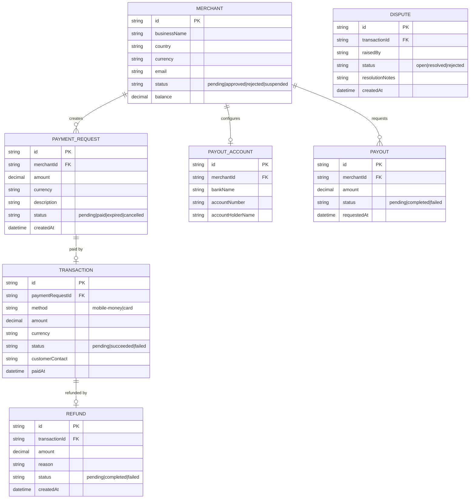

# Domain Model

Core entities for the merchant payments platform: merchants and their payout
accounts, the payment requests they issue, the transactions customers make
against them, and the payouts merchants draw from their balance.

`MERCHANT.status` gates whether a merchant can create payment requests
(`approved` only). `TRANSACTION` records the outcome of a customer paying a
`PAYMENT_REQUEST` through the payment gateway, by either rail. A `DISPUTE`
references a `TRANSACTION` and is worked by a Platform Admin.