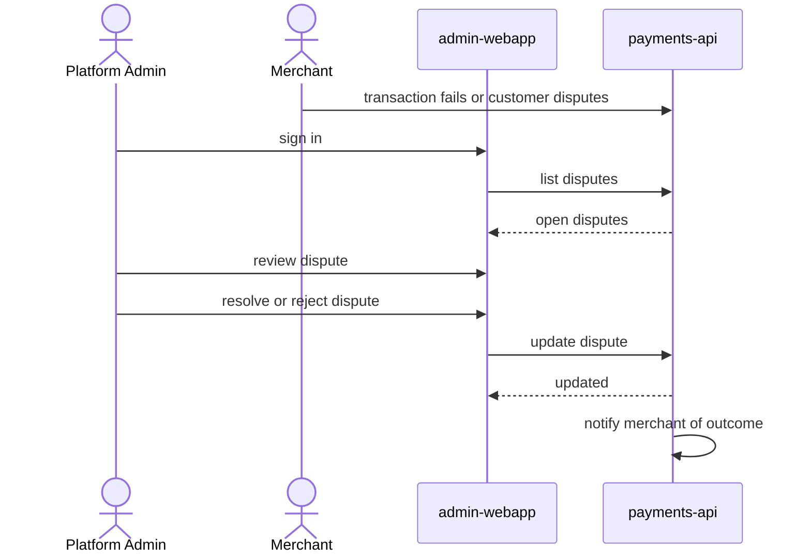

# Admin Dispute Handling

A Platform Admin reviews a disputed or failed transaction escalated beyond
what the merchant can resolve.

```mermaid
sequenceDiagram
    actor Admin as Platform Admin
    actor Merchant
    participant adminweb as admin-webapp
    participant api as payments-api

    Merchant->>api: transaction fails or customer disputes
    Admin->>adminweb: sign in
    adminweb->>api: list disputes
    api-->>adminweb: open disputes
    Admin->>adminweb: review dispute
    Admin->>adminweb: resolve or reject dispute
    adminweb->>api: update dispute
    api-->>adminweb: updated
    api->>api: notify merchant of outcome
```

