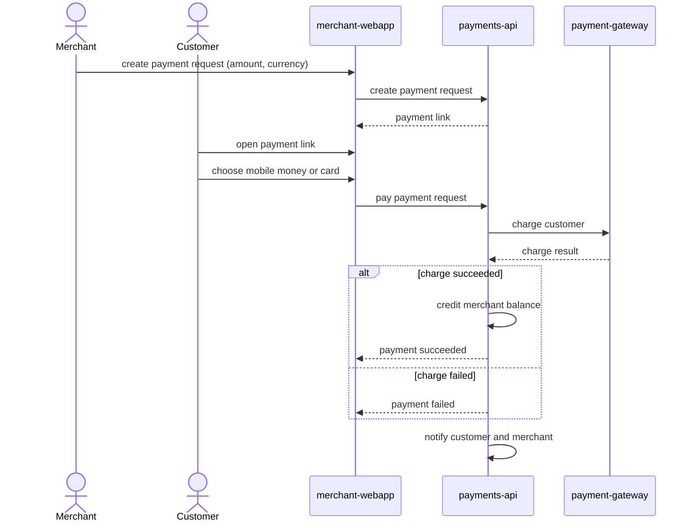

# Customer Payment

A Merchant creates a payment request and a Customer pays it by mobile money
or card, then both are notified of the outcome.

```mermaid
sequenceDiagram
    actor Merchant
    actor Customer
    participant merchantweb as merchant-webapp
    participant api as payments-api
    participant gateway as payment-gateway

    Merchant->>merchantweb: create payment request (amount, currency)
    merchantweb->>api: create payment request
    api-->>merchantweb: payment link

    Customer->>merchantweb: open payment link
    Customer->>merchantweb: choose mobile money or card
    merchantweb->>api: pay payment request
    api->>gateway: charge customer
    gateway-->>api: charge result

    alt charge succeeded
        api->>api: credit merchant balance
        api-->>merchantweb: payment succeeded
    else charge failed
        api-->>merchantweb: payment failed
    end

    api->>api: notify customer and merchant
```

