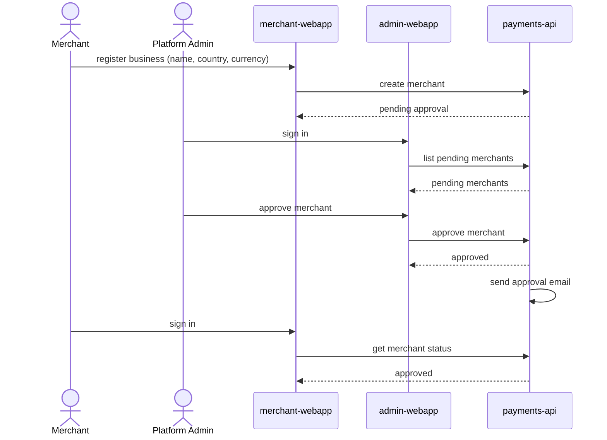

# Merchant Onboarding

A Merchant registers a business and a Platform Admin reviews it before the
merchant can start collecting payments.

```mermaid
sequenceDiagram
    actor Merchant
    actor Admin as Platform Admin
    participant merchantweb as merchant-webapp
    participant adminweb as admin-webapp
    participant api as payments-api

    Merchant->>merchantweb: register business (name, country, currency)
    merchantweb->>api: create merchant
    api-->>merchantweb: pending approval

    Admin->>adminweb: sign in
    adminweb->>api: list pending merchants
    api-->>adminweb: pending merchants
    Admin->>adminweb: approve merchant
    adminweb->>api: approve merchant
    api-->>adminweb: approved

    api->>api: send approval email
    Merchant->>merchantweb: sign in
    merchantweb->>api: get merchant status
    api-->>merchantweb: approved
```

