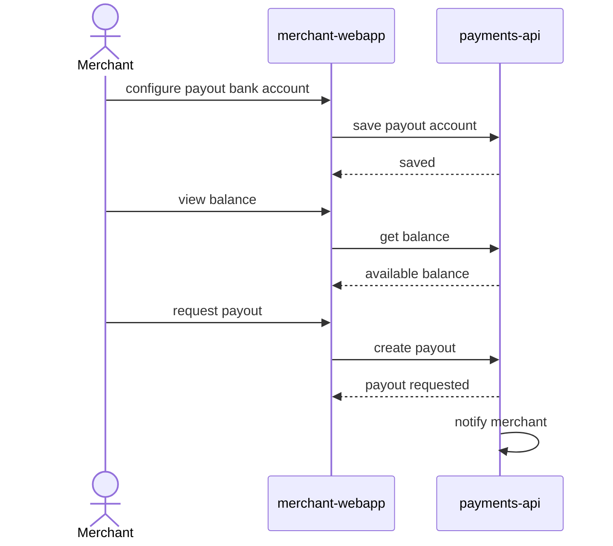

# Merchant Payout

A Merchant configures a payout bank account and requests a payout of its
collected balance.

```mermaid
sequenceDiagram
    actor Merchant
    participant merchantweb as merchant-webapp
    participant api as payments-api

    Merchant->>merchantweb: configure payout bank account
    merchantweb->>api: save payout account
    api-->>merchantweb: saved

    Merchant->>merchantweb: view balance
    merchantweb->>api: get balance
    api-->>merchantweb: available balance

    Merchant->>merchantweb: request payout
    merchantweb->>api: create payout
    api-->>merchantweb: payout requested

    api->>api: notify merchant
```

